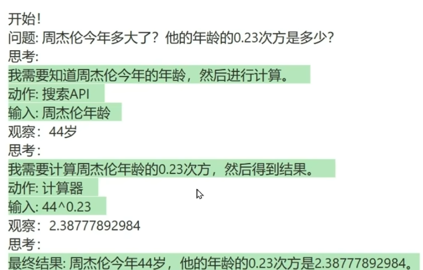

# My AI Agent

尽可能的去回答以下问题，你可以使用以下的工具：
[{工具名和描述}]

请使用以下格式回答：

问题：你必须回答的问题
思考：你应该一直保持思考，思考要怎么解决问题
动作：<工具名>。每次动作只选择一个工具。工具列表[{工具名和描述}]
输入：<调用工具时需要传入的参数>
观察：<第三方工具返回的结果>

... 这个 “思考-动作-输入-观察” 的循环可以重复 N 次

思考：最后，你应该知道最终结果了
最终结果：针对于原始问题，输出最终结果

开始！

问题：{问题}
思考：

