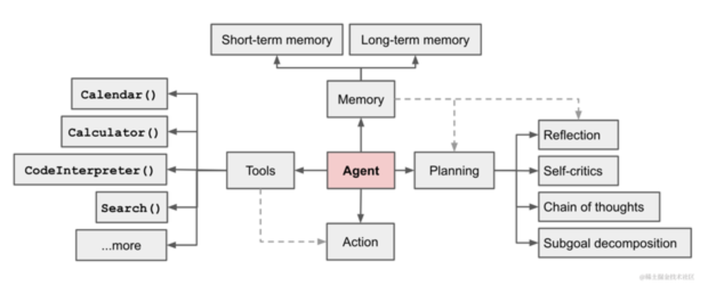

# My AI Agent

## 介绍

这是一个简单的 AI Agent，用于解决一些简单的问题。主要目的是为了学习和研究。

## Agent

## 问题

1. pyo3 编译失败，提示找不到 Python
   解决办法：使用[pyenv](https://github.com/pyenv/pyenv)安装好 python 环境后，重新编译即可。

## 参考资料

- [Chain-of-Thought Prompting Elicits Reasoning in Large Language Models](https://ar5iv.labs.arxiv.org/html/2201.11903)
- [Synergizing Reasoning and Acting in Language Models](https://ar5iv.labs.arxiv.org/html/2210.03629)
- [周杰伦年龄的 0.23 次方是多少？利用 ReAct 实现 ChatGPT 插件（AutoGPT 基础）](https://www.bilibili.com/video/BV1jP411d7or/?p=4&spm_id_from=333.880.my_history.page.click&vd_source=56a65708f3ed01335264f19b8a281094)

各位兄弟有对 AI Agent 感兴趣的吗？我用 Rust 构建了一个简单的，用来学习研究的。欢迎大家一起交流。
https://github.com/nanlong/my-agent
